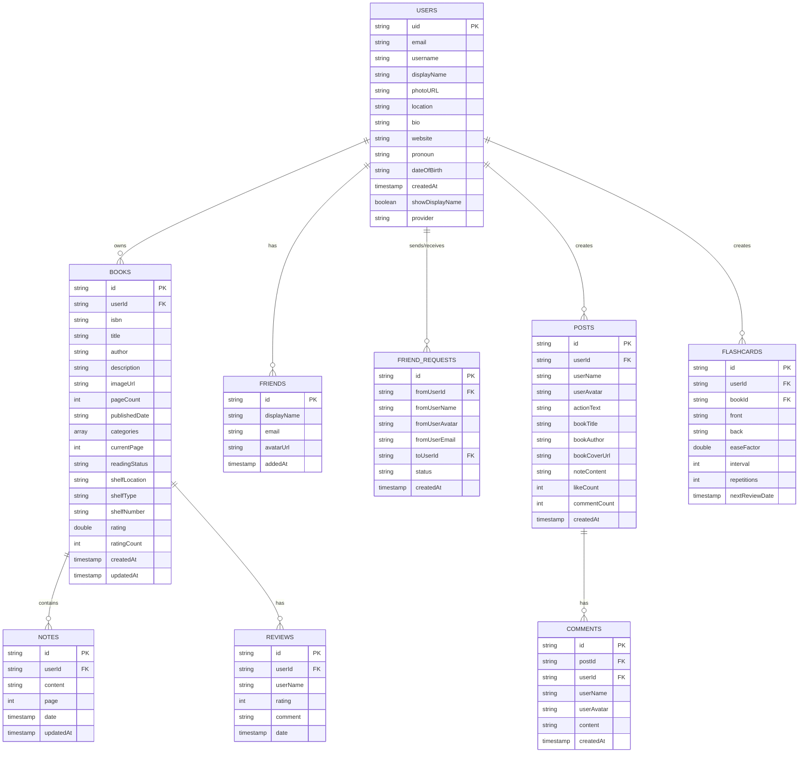

# Trạm Đọc - Cơ Sở Dữ Liệu (Firebase Firestore)

## Sơ Đồ Quan Hệ



---

## Chi Tiết Collections

### 1. 👤 Collection: `users`

| Field | Type | Mô tả |
|-------|------|-------|
| `uid` | `string` | ID người dùng (từ Firebase Auth) |
| `email` | `string` | Email đăng nhập |
| `username` | `string?` | Tên người dùng (unique) |
| `displayName` | `string?` | Tên hiển thị |
| `photoURL` | `string?` | URL ảnh đại diện |
| `location` | `string?` | Địa điểm |
| `bio` | `string?` | Giới thiệu bản thân |
| `website` | `string?` | Website cá nhân |
| `pronoun` | `string?` | Đại từ nhân xưng |
| `dateOfBirth` | `string?` | Ngày sinh |
| `createdAt` | `timestamp` | Ngày tạo tài khoản |
| `showDisplayName` | `boolean` | Hiển thị tên hay username |
| `provider` | `string?` | Nhà cung cấp xác thực (email/google) |

#### Sub-collection: `users/{uid}/friends`

| Field | Type | Mô tả |
|-------|------|-------|
| `displayName` | `string` | Tên hiển thị của bạn |
| `email` | `string` | Email của bạn |
| `avatarUrl` | `string?` | Ảnh đại diện |
| `addedAt` | `timestamp` | Ngày kết bạn |

---

### 2. 📚 Collection: `books`

| Field | Type | Mô tả |
|-------|------|-------|
| `id` | `string` | ID sách (auto-generated) |
| `userId` | `string` | ID người sở hữu |
| `isbn` | `string?` | Mã ISBN |
| `title` | `string` | Tiêu đề sách |
| `author` | `string` | Tác giả |
| `description` | `string?` | Mô tả sách |
| `imageUrl` | `string` | URL ảnh bìa |
| `pageCount` | `int?` | Tổng số trang |
| `publishedDate` | `string?` | Ngày xuất bản |
| `categories` | `array<string>?` | Thể loại |
| `currentPage` | `int` | Trang đang đọc (default: 0) |
| `readingStatus` | `string` | Trạng thái: `wantToRead`, `reading`, `completed` |
| `shelfLocation` | `string?` | Vị trí sách |
| `shelfType` | `string?` | Loại kệ |
| `shelfNumber` | `string?` | Số kệ |
| `rating` | `double?` | Điểm đánh giá trung bình |
| `ratingCount` | `int?` | Số lượng đánh giá |
| `createdAt` | `timestamp` | Ngày thêm sách |
| `updatedAt` | `timestamp` | Lần cập nhật cuối |

#### Sub-collection: `books/{bookId}/notes`

| Field | Type | Mô tả |
|-------|------|-------|
| `id` | `string` | ID ghi chú |
| `userId` | `string` | ID người tạo |
| `content` | `string` | Nội dung ghi chú |
| `page` | `int` | Số trang |
| `date` | `timestamp` | Ngày tạo |
| `updatedAt` | `timestamp?` | Ngày cập nhật |

#### Sub-collection: `books/{bookId}/reviews`

| Field | Type | Mô tả |
|-------|------|-------|
| `id` | `string` | ID đánh giá |
| `userId` | `string` | ID người đánh giá |
| `userName` | `string` | Tên người đánh giá |
| `rating` | `int` | Số sao (1-5) |
| `comment` | `string` | Nội dung đánh giá |
| `date` | `timestamp` | Ngày đánh giá |

---

### 3. 🎴 Collection: `flashcards`

| Field | Type | Mô tả |
|-------|------|-------|
| `id` | `string` | ID thẻ |
| `userId` | `string` | ID người tạo |
| `bookId` | `string` | ID sách liên quan |
| `front` | `string` | Mặt trước (câu hỏi) |
| `back` | `string` | Mặt sau (câu trả lời) |
| `easeFactor` | `double` | Hệ số dễ (SM-2 algorithm, default: 2.5) |
| `interval` | `int` | Khoảng cách ôn tập (ngày) |
| `repetitions` | `int` | Số lần đã ôn |
| `nextReviewDate` | `timestamp?` | Ngày ôn tập tiếp theo |
| `createdAt` | `timestamp` | Ngày tạo thẻ |

---

### 4. 📊 Collection: `flashcard_reviews`

> Lịch sử ôn tập flashcard (dùng để tính streak)

| Field | Type | Mô tả |
|-------|------|-------|
| `id` | `string` | ID log |
| `flashcardId` | `string` | ID thẻ đã ôn |
| `userId` | `string` | ID người ôn |
| `rating` | `int` | Điểm đánh giá (1-5) |
| `reviewDate` | `timestamp` | Ngày ôn tập |

---

### 5. 📝 Collection: `posts`

| Field | Type | Mô tả |
|-------|------|-------|
| `id` | `string` | ID bài viết |
| `userId` | `string` | ID người đăng |
| `userName` | `string` | Tên người đăng |
| `userAvatar` | `string?` | Ảnh đại diện |
| `actionText` | `string` | Mô tả hành động (vd: "đã ghi chú về...") |
| `bookTitle` | `string?` | Tên sách |
| `bookAuthor` | `string?` | Tác giả sách |
| `bookCoverUrl` | `string?` | Ảnh bìa sách |
| `noteContent` | `string?` | Nội dung ghi chú chia sẻ |
| `likeCount` | `int` | Số lượt thích |
| `commentCount` | `int` | Số bình luận |
| `createdAt` | `timestamp` | Ngày đăng |

#### Sub-collection: `posts/{postId}/comments`

| Field | Type | Mô tả |
|-------|------|-------|
| `id` | `string` | ID bình luận |
| `postId` | `string` | ID bài viết |
| `userId` | `string` | ID người bình luận |
| `userName` | `string` | Tên người bình luận |
| `userAvatar` | `string?` | Ảnh đại diện |
| `content` | `string` | Nội dung bình luận |
| `createdAt` | `timestamp` | Ngày bình luận |

---

### 6. 🤝 Collection: `friend_requests`

| Field | Type | Mô tả |
|-------|------|-------|
| `id` | `string` | ID lời mời |
| `fromUserId` | `string` | ID người gửi |
| `fromUserName` | `string` | Tên người gửi |
| `fromUserAvatar` | `string?` | Ảnh đại diện người gửi |
| `fromUserEmail` | `string` | Email người gửi |
| `toUserId` | `string` | ID người nhận |
| `status` | `string` | Trạng thái: `pending`, `accepted`, `rejected` |
| `createdAt` | `timestamp` | Ngày gửi |

---

### 📌 Sub-collection bổ sung trong `users`

#### Sub-collection: `users/{uid}/readingActivities`

> Hoạt động đọc sách hàng ngày (dùng để tính streak)

| Field | Type | Mô tả |
|-------|------|-------|
| `id` | `string` | ID = ngày (yyyy-MM-dd) |
| `date` | `timestamp` | Ngày hoạt động |
| `minutesRead` | `int` | Số phút đã đọc |
| `updatedAt` | `timestamp` | Lần cập nhật cuối |

---

## Firestore Rules (Đề xuất)

```javascript
rules_version = '2';
service cloud.firestore {
  match /databases/{database}/documents {
    
    // Users - chỉ chủ sở hữu mới có thể đọc/ghi
    match /users/{userId} {
      allow read: if request.auth != null;
      allow write: if request.auth.uid == userId;
      
      match /friends/{friendId} {
        allow read, write: if request.auth.uid == userId;
      }
      
      match /readingActivities/{activityId} {
        allow read, write: if request.auth.uid == userId;
      }
    }
    
    // Books - chỉ chủ sở hữu mới có thể đọc/ghi
    match /books/{bookId} {
      allow read: if request.auth != null;
      allow write: if request.auth.uid == resource.data.userId;
      
      match /notes/{noteId} {
        allow read, write: if request.auth != null;
      }
      
      match /reviews/{reviewId} {
        allow read: if request.auth != null;
        allow write: if request.auth != null;
      }
    }
    
    // Flashcards
    match /flashcards/{cardId} {
      allow read, write: if request.auth.uid == resource.data.userId;
    }
    
    // Flashcard Reviews (lịch sử ôn tập)
    match /flashcard_reviews/{reviewId} {
      allow read, write: if request.auth.uid == resource.data.userId;
    }
    
    // Posts - ai cũng có thể đọc, chỉ chủ sở hữu mới có thể xóa
    match /posts/{postId} {
      allow read: if request.auth != null;
      allow create: if request.auth != null;
      allow delete: if request.auth.uid == resource.data.userId;
      
      match /comments/{commentId} {
        allow read: if request.auth != null;
        allow create: if request.auth != null;
        allow delete: if request.auth.uid == resource.data.userId;
      }
    }
    
    // Friend requests
    match /friend_requests/{requestId} {
      allow read: if request.auth.uid == resource.data.fromUserId 
                  || request.auth.uid == resource.data.toUserId;
      allow create: if request.auth != null;
      allow update, delete: if request.auth.uid == resource.data.toUserId;
    }
  }
}
```

---

## Indexes Cần Tạo

| Collection | Fields | Type |
|------------|--------|------|
| `books` | `userId`, `createdAt` (desc) | Composite |
| `books` | `userId`, `readingStatus` | Composite |
| `posts` | `createdAt` (desc) | Single |
| `flashcards` | `userId`, `bookId` | Composite |
| `flashcards` | `userId`, `nextReviewDate` | Composite |
| `flashcard_reviews` | `userId`, `reviewDate` (desc) | Composite |
| `friend_requests` | `toUserId`, `status` | Composite |

